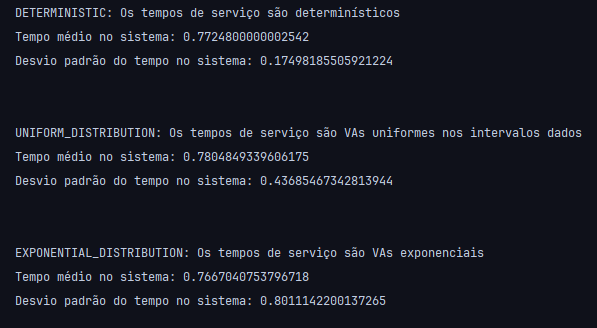
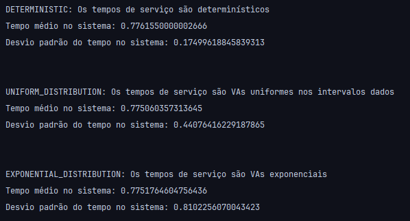
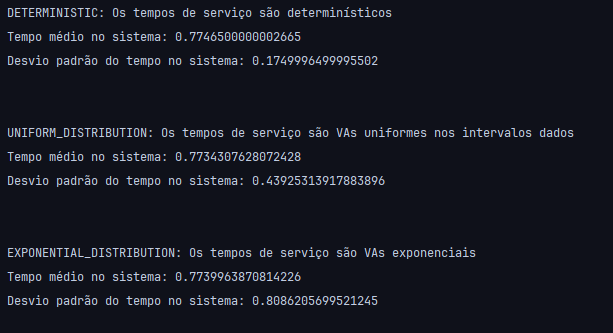
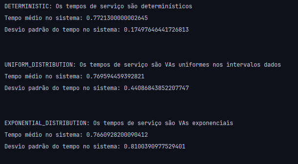
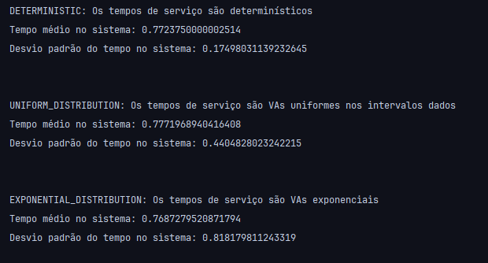

# Simuladores de processamento de jobs em um sistema de filas com 3 servidores

## Introdução

Esse projeto foi desenvolvido como trabalho final da disciplina Modelagem e Avaliação de Desempenho (UFRJ 2024.2.

O objetivo foi implementar simuladores de redes de filas abertas compostas por três servidores: S1, S2 e S3. Cada servidor está associado a uma fila de capacidade ilimitada.

Algumas premissas foram definidas:
- Jobs chegam no sistema de acordo com um processo de Poisson com taxa `λ = 2 jobs/s`
- O S1 é o ponto de partida e todos os jobs o acessam
- As probabilidades de um job seguir para o S2 ou S3 são `p = 0.5`
- Após ser processado em S2, o job pode retornar à fila do S2 com probabilidade `p = 0.2` ou sair do sistema com probabilidade `p = 0.8`
- Após ser processado em S3, o job sai do sistema

Um diagrama demonstrando esse sistema pode ser observado abaixo:


Foram feitas 3 simulações com variações nos tempos de serviço de cada servidor:

- Determinísticos:
  - S1: 0.4s
  - S2: 0.6s
  - S3: 0.95s
- Variáveis Aleatórias uniformes, tal que `S ~ Unif(min, max)`:
  - S1: (0.1, 0.7)
  - S2: (0.1, 1.1)
  - S3: (0.1, 1.8)
- Variáveis Aleatórias exponenciais, tal que `S ~ Exp(λ) e E[S]=1/λ`:
  - E[S1]: 0.4s
  - E[S2]: 0.6s
  - E[S3]: 0.95s

Para as simulações, foram utilizados 10_000 jobs para treinamento e 10_000 jobs para os testes e para retirada das métricas dos resultados.

## Resultados

Abaixo seguem os prints de 5 simulações executadas para cada tipo:


### 1)


---

### 2)


---

### 3)


---

### 4)


---

### 5)


---

## Conclusões

Para o cenário determinístico, houve pouca variabilidade nos tempos de resposta, dado o valor do desvio padrão em todas as rodadas. Por ser um processo determinístico, os jobs fluem pelo sistema de forma bem previsível.

Com os tempos de serviço seguindo uma distribuição uniforme, houve maior dispersão nos tempos de resposta (visto pelo desvio padrão aumentado), isso fica claro pois aqui foi introduzido um processo estocástico. Ainda assim, o tempo médio de resposta manteve-se próximo do anterior dado que os intervalos dados para buscar a amostra da VA uniforme estão alinhados com os valores dados no cenário determinístico.

Para os tempos de serviço exponenciais, a variabilidade é ainda maior, dado que segue um gráfico exponencial, mesmo que tenha sido definido um intervalo de 0 a 1.0 para a amostra uniforme utilizada para obter a amostra na fórmula da inversa da CDF. Ainda sobre o gráfico, por ser bem assimétrico, o desvio padrão aumenta bastante para o tempo médio de resposta.

No geral, os tempos médios de serviço foram bem próximos, mas sempre melhores em casos onde os tempos de serviço foram obtidos através de um processo estocástico, ao custo de uma maior variabilidade nos resultados.

## Para executar

- Para executar as simulações, basta executar o arquivo Main.kt:
  - A forma mais fácil é utilizando uma IDE que automatize este processo, como o IntelliJ
  - Outra forma é buildar a aplicação e rodar o arquivo:
    - Para buildar:
    ```
    ./gradlew clean build
    ```
    - O arquivo irá aparecer dentro da pasta build
    - Para rodar, basta executar:
    ``` 
    ./gradlew run
    ```